# T1N Smart Module

Native Apple HomeKey + HomeKit NFC enabled smart lock system for the T1N series Sprinter that reads real lock state from the factory CTM. Optional integration into Home Assistant to read driver/passenger door ajar states for additional automation. Local and remote lock capability anywhere your van gets internet - all from your favorite Apple device.

Long live the million mile Sprinter!

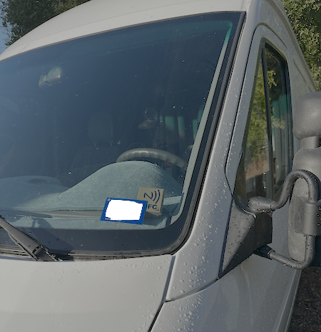

---

## Why

Factory T1N fobs are unreliable with zero lock-state feedback. Aftermarket kits aren't any better.

This module taps the CTM's LED driver lines to know true lock/door ajar states, and pulses the factory switch inputs to control locks. The CTM doesn't know the difference, leaving oem logic and functionality 100% intact. This also costs way less than replacing the lackluster fobs and can be entirely integrated easily into your smart van.

---

## Features

- **Apple HomeKey** — tap iPhone or Apple Watch on the NFC reader to lock/unlock, even in Express Mode when Apple device is 'dead'
- **Native HomeKit** via [HAP-ESPHome](https://github.com/rednblkx/HAP-ESPHome)
- **Siri Enabled** - ask Siri to toggle the locks using just your voice
- **Home Assistant** compatible for optional door sensor integration into HomeKit
- **True lock-state detection** — PC817 optocouplers read CTM LED sense lines (galvanically isolated)
- **Independent Driver Door & Passenger Door control**
- **Reversible install** — Cat6/RJ45, terminal block to master lock switch interconnect, remove in minutes
- **OTA updates** via ESPHome
- **Remote capable** — operates from anywhere the van has internet

---

## Architecture

```
DASH MODULE
┌─────────────────────────────────────────────────────────────────┐
│                                                                 │
│   ┌──────────────┐       SPI       ┌──────────────┐             │
│   │  XIAO        │◄───────────────►│   PN532      │             │
│   │  ESP32-C6    │                 │   NFC Module │             │
│   └──────┬───────┘                 └──────────────┘             │
│          │                                                      │
└──────────┼──────────────────────────────────────────────────────┘
           │  Cat6 / RJ45
           │   - 2x trigger (transistor-switched)
           │   - 2x LED sense (optocoupler-isolated)
           │   - 5V + GND
┌──────────┼──────────────────────────────────────────────────────┐
│ INTERFACE BOX (behind center console)                           │
│   ┌──────▼───────┐                                              │
│   │  Terminal    │──► W/Y  → Driver Door lock trigger → CTM     │
│   │  Block       │──► W/R  → Passenger Door lock trigger → CTM  │
│   │  Connections │◄── W/B  ← Driver Door LED sense ← CTM        │
│   │              │◄── W/DG ← Passenger Door LED sense ← CTM     │
│   │ + -          │ ACC1 (unused)                                │
│   └──────────────┘ ACC2 (unused)                                │
│   ◄── + 12V → 5V buck converter + 2A fuse                       │
|   ──► - 5V buck converter + chassis GND                         |
└─────────────────────────────────────────────────────────────────┘
```

**Lock control:** 2N2222A NPN transistors pulse CTM switch inputs to ground (500ms pulse, 1200ms cooldown).
**State detection:** PC817 optocouplers on CTM LED driver lines — `INPUT_PULLUP`, inverted.

> Wire colors reference the **2005 Dodge Sprinter**. Verify against your vehicle.

---

## Lock State Truth Loop

Runs every 250ms. Each door evaluated independently.

| LED State | Condition | Result |
|---|---|---|
| SOLID | ON 500ms+ | Locked |
| BLINK | Edge within 1500ms | Ajar / unlocked |
| OFF | Other LED active | Unlocked (CTM awake) |
| OFF | Was ON < 5s ago | Unlocked (transition) |
| OFF | Both dark > 5s | CTM sleep — hold last known state |

---

## In Action

### HomeKey in Wallet

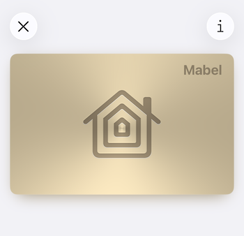

### Locked

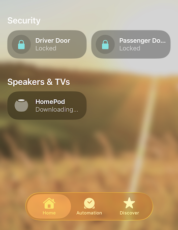
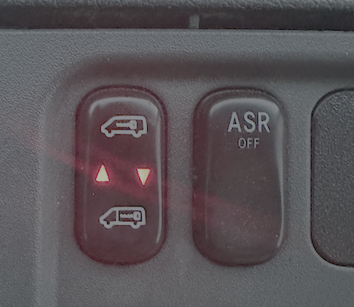

### Unlocked


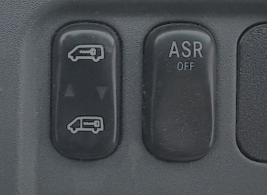

### Passenger Door Open (Door Ajar via Home Assistant as binary sensor, Passenger LED Blinking)

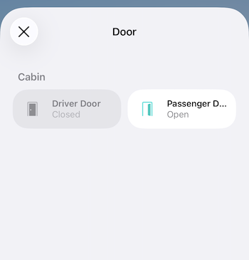
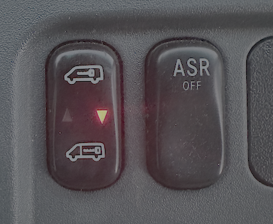

---

## Hardware

| Component | Qty | Purpose |
|-----------|:---:|---------|
| [XIAO ESP32-C6](https://wiki.seeedstudio.com/xiao_esp32c6_getting_started/) | 1 | MCU |
| PN532 NFC (SPI) | 1 | HomeKey |
| PC817 Optocoupler | 2 | LED sense isolation |
| 2N2222A NPN | 2 | Lock pulse output |
| 1k Resistor | 2 | Current limiting, optocoupler |
| 2.2k Resistor | 2 | Current limiting, transistor |
| Cat6 RJ45 Jack | 2 | Interconnect |
| 12V→5V Buck | 1 | Power |
| 2A Fuse | 1 | Protection |
| Terminal Block | 1 | CTM connections |

### GPIO

| Pin | Function |
|-----|----------|
| GPIO1 | Driver Door pulse (2N2222A base) |
| GPIO2 | Passenger Door pulse (2N2222A base) |
| GPIO18 | SPI MOSI (PN532) |
| GPIO19 | SPI CLK (PN532) |
| GPIO20 | SPI MISO (PN532) |
| GPIO21 | SPI CS (PN532) |
| GPIO22 | Driver Door LED sense (PC817) |
| GPIO23 | Passenger Door LED sense (PC817) |

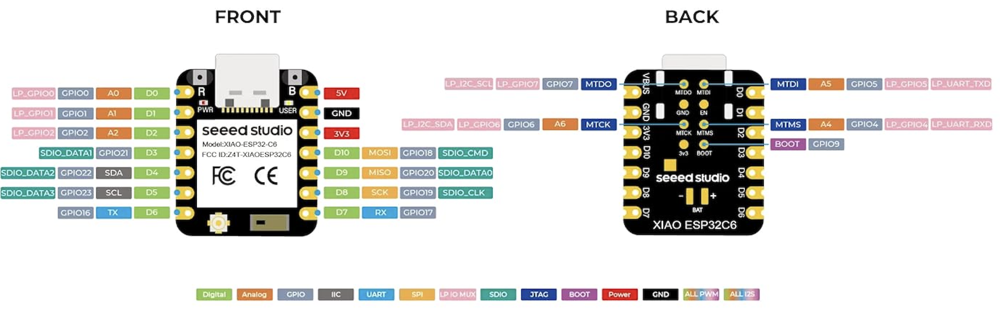

### CTM Wiring (2005 Dodge Sprinter)

| Wire | Function | Direction |
|---|---|---|
| White/Yellow | Driver Door lock trigger (all doors) | Module → CTM |
| White/Red | Passenger Door lock trigger | Module → CTM |
| White/Black | Driver Door LED sense | CTM → Module |
| White/Dark Green | Passenger Door LED sense | CTM → Module |
| Brown | Ground | Common |

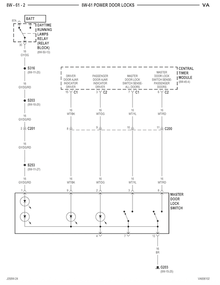

### Locks

| Lock | HomeKit | HomeKey (NFC) |
|------|:-------:|:-------------:|
| **Driver Door** | Yes | Yes |
| **Passenger Door** | Yes | No |

Door ajar sensors for both doors are exposed to Home Assistant as `binary_sensor` with `device_class: door` and are detected as a door being open or closed. Passenger, slider, and cargo doors are all connected and considered passenger.

---

## Prototype V1

### Enclosure

Two 3D-printed enclosures: an angled dash module with NFC face and magnetic lid, and a compact interface box with RJ45 jack and labeled terminal block.

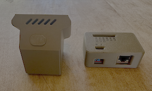

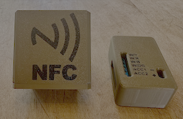

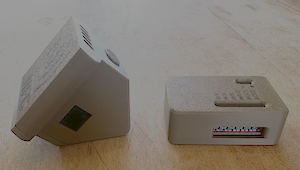

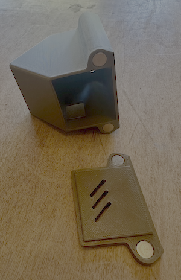

### Board

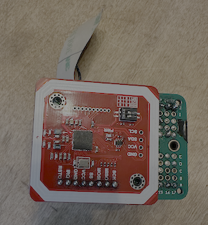


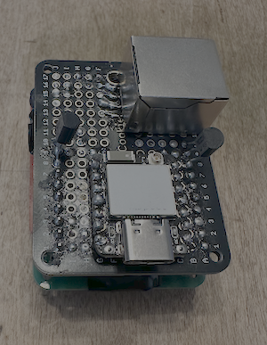

### Installed

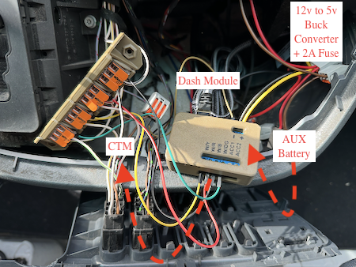

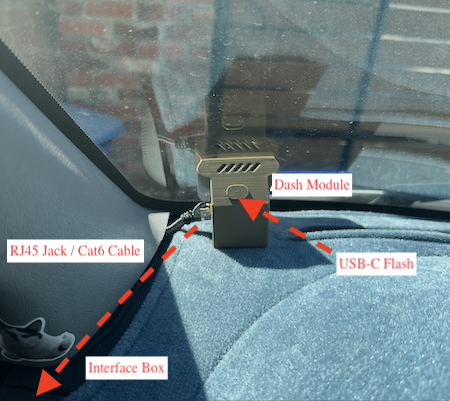

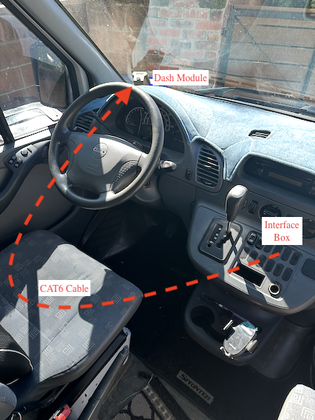

### Breadboard Origins

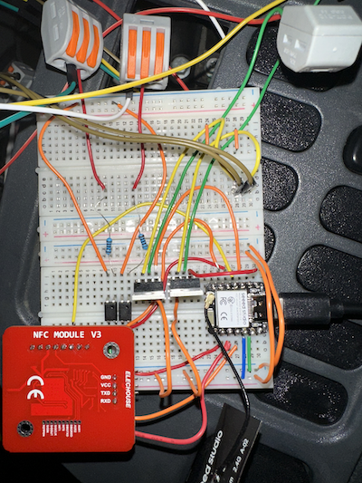

---

## Flashing

```bash
cd firmware
cp secrets.yaml.example secrets.yaml   # fill in your credentials
esphome run t1n_smart_module.yaml
```

Pair in Apple Home with setup code `159-35-728`.

---

## Dependencies

- [ESPHome](https://esphome.io/)
- [HAP-ESPHome](https://github.com/rednblkx/HAP-ESPHome) — HomeKit + HomeKey
- [Home Assistant](https://www.home-assistant.io/) (optional)

---

## Disclaimer

Interfaces with vehicle lock systems. Use at your own risk. Verify wiring on your vehicle. Not affiliated with Daimler, Mercedes-Benz, Dodge, Stellantis, or Apple. Made with duct tape and bird shit.
