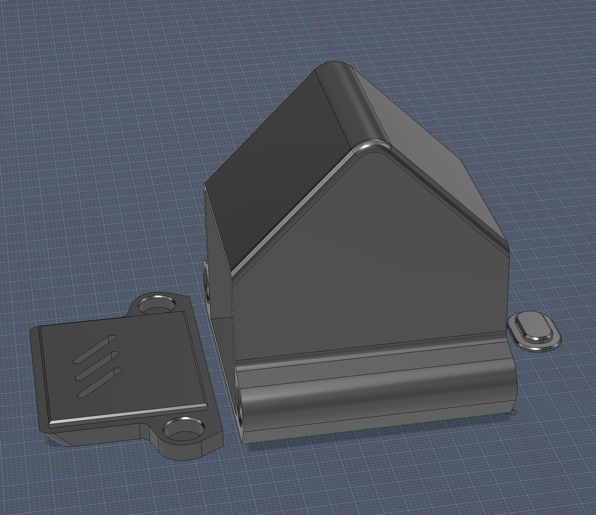
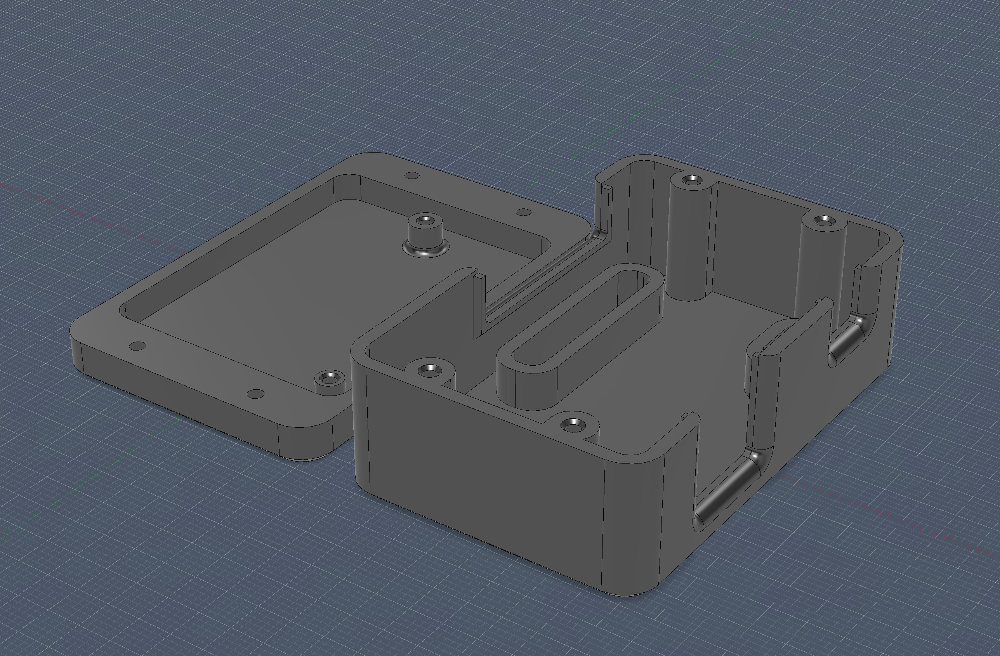

# CAD Files

3D-printable enclosures for the T1N Smart Module, designed in Fusion 360.

---

## Door Module (`T1NDoorModuleNFCVertical`)

Angled dash-mount enclosure with NFC reader face and magnetic lid. Mounts to the windshield dash area for easy tap access with iPhone or Apple Watch.

---

## Cabin Enclosure (`T1NCabinEnclosure`)

Interface box that houses the perfboard, RJ45 jack, and terminal block connections. Installs behind the center console.

---

## Print Settings

| Setting | Recommendation |
|---------|---------------|
| **Material** | ASA (recommended for heat and UV resistance in a vehicle) |
| **Supports** | None required — bridging-friendly design |
| **Magnets** | 8x3mm neodymium round magnets for door latch |

> Port locations will vary by installation — this is a proof of concept. Modify the STEP files in Fusion 360 to suit your build.

---

## File Formats

- **`.stl`** — Print-ready, oriented for the build plate
- **`.step`** — Parametric source files for modification in Fusion 360 or any CAD tool
